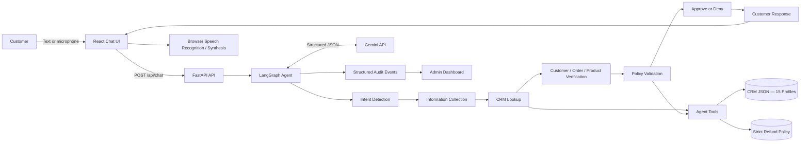
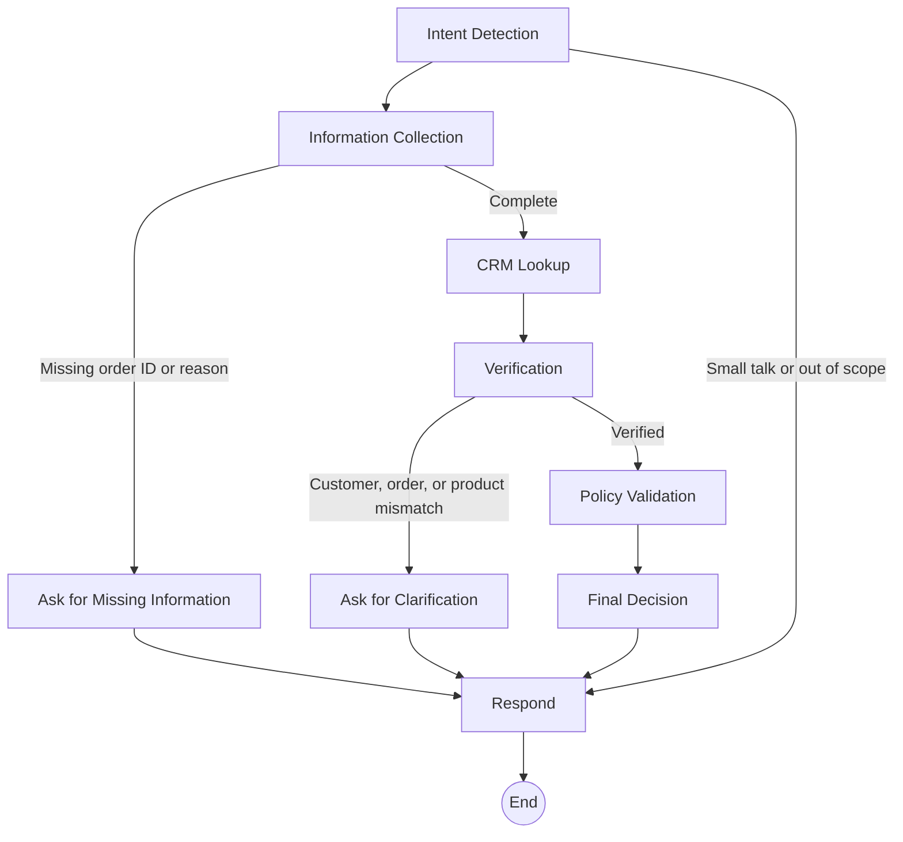
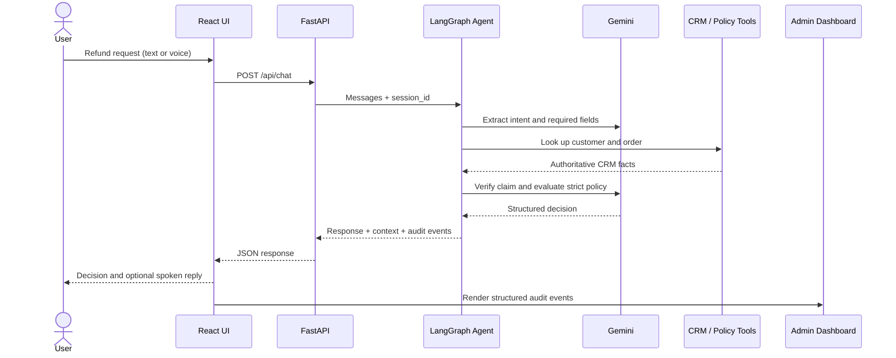

# ARIA — AI Refund Support Agent

ARIA is a policy-aware customer-support application that evaluates e-commerce refund, return, exchange, and eligibility requests. It combines a React customer chat, browser voice support, a FastAPI API, a LangGraph workflow, Gemini language understanding, a 15-customer mock CRM, a strict refund policy, and an administrator audit dashboard.

> This is a demonstration application. Refund decisions are recorded and displayed, but no real payment provider or production CRM is modified.

## Features

- Multi-turn refund conversations with session memory
- Explicit LangGraph workflow with conditional exits
- Gemini-powered intent extraction, product verification, policy evaluation, and response drafting
- Tool-based CRM and order lookup
- Strict policy grounding with policy-rule citations in decisions
- Approved, denied, clarification, mismatch, and out-of-scope flows
- Structured administrator audit events (not private chain-of-thought)
- Browser microphone input and spoken agent responses
- Spoken order-number normalization such as `1188`, “one one eight eight,” and “double five double four”
- Gemini retry, fallback-model, fenced-JSON, and malformed-suffix recovery
- Mock CRM with 15 customer profiles and a versioned refund-policy document

## Architecture



### Agent workflow



### Request sequence



## Technology stack

| Layer | Technology |
|---|---|
| Frontend | React 18, Lucide React, browser Web Speech APIs |
| Backend | Python, FastAPI, Uvicorn, Pydantic |
| Agent orchestration | LangGraph |
| LLM integration | LangChain Google GenAI, Gemini |
| Data | JSON mock CRM and plain-text policy |
| Testing | pytest |

## Project structure

```text
refund-agent/
├── backend/
│   ├── .env.example          # Safe configuration template
│   ├── main.py               # Uvicorn entry point
│   ├── test_order_ids.py     # Order normalization/lookup tests
│   └── app/
│       ├── agent.py          # LangGraph nodes, edges, memory and audit events
│       ├── api.py            # /api/chat, /api/customers and /api/health
│       ├── config.py         # Environment and data-path configuration
│       ├── data.py           # Loads CRM and refund policy
│       ├── llm.py            # Gemini client, fallback and JSON recovery
│       ├── main.py           # FastAPI application and CORS
│       ├── order_ids.py      # Spoken/abbreviated order-ID normalization
│       ├── prompts.py        # Structured LLM prompts
│       ├── schemas.py        # API request models
│       └── tools.py          # CRM and policy tools
├── data/
│   ├── crm_database.json     # 15 mock customer profiles and orders
│   └── refund_policy.txt     # Strict ShopEase refund policy
├── frontend/
│   ├── public/
│   ├── src/App.js            # Chat, voice and admin dashboard
│   ├── package.json
│   └── package-lock.json
├── .gitignore
├── requirements.txt
└── README.md
```

## Prerequisites

- Python 3.11 or 3.12
- Node.js 18 or 20 LTS
- npm
- A Gemini API key from [Google AI Studio](https://aistudio.google.com/app/apikey)
- Chrome or Edge for microphone input (recommended)

## Quick start

### 1. Clone the repository

```bash
git clone https://github.com/Pratiksha-patel-213707/refund-agent.git
cd refund-agent
```

### 2. Create and activate a Python environment

Windows PowerShell:

```powershell
py -m venv .venv
.venv\Scripts\Activate.ps1
python -m pip install --upgrade pip
python -m pip install -r requirements.txt
```

macOS/Linux:

```bash
python3 -m venv .venv
source .venv/bin/activate
python -m pip install --upgrade pip
python -m pip install -r requirements.txt
```

### 3. Configure Gemini

Windows PowerShell:

```powershell
Copy-Item backend\.env.example backend\.env
```

macOS/Linux:

```bash
cp backend/.env.example backend/.env
```

Edit `backend/.env`:

```env
GEMINI_API_KEY="YOUR_GEMINI_API_KEY_HERE"
GEMINI_MODEL="gemini-3.5-flash"
GEMINI_FALLBACK_MODEL="gemini-2.5-flash-lite"
GEMINI_MAX_OUTPUT_TOKENS="4096"
GEMINI_THINKING_BUDGET="0"
POLICY_EVALUATION_DATE="2024-06-18"
```

`backend/.env` is ignored by Git. Never commit or place a real API key in frontend code.

`POLICY_EVALUATION_DATE` is intentionally pinned because the bundled CRM represents a 2024 demonstration dataset. Changing it to the current date will place most sample orders outside their policy windows.

### 4. Start the backend

From the repository root:

```bash
cd backend
uvicorn main:app --reload --port 8000
```

Verify it at:

- Health: <http://localhost:8000/api/health>
- Interactive API docs: <http://localhost:8000/docs>

### 5. Start the frontend

Open another terminal:

```bash
cd frontend
npm ci
npm start
```

Open <http://localhost:3000>.

## Run the tests

Activate the Python environment, then run from the repository root:

```bash
cd backend
pytest -q
```

The included tests cover abbreviated and voice-style order numbers, including:

- `1188` → `ORD-2024-1188`
- “order five five four four” → `ORD-2024-5544`
- “order double five double four” → `ORD-2024-5544`
- Unique four-digit CRM suffix lookup

Build-check the frontend with:

```bash
cd frontend
npm run build
```

## Demo scenarios

The sample CRM and policy evaluation date make these cases reproducible.

### Approved refund

```text
I need a refund for ORD-2024-5544. My Fossil smartwatch arrived defective.
```

Expected: approved because the defective electronics claim is inside the three-day window. Photo/video evidence is required within 24 hours.

### Voice and multi-turn order ID

```text
User: I want a refund because my smartwatch arrived defective.
Agent: What is the order ID?
User: Five five four four.
```

Expected: the agent resolves the spoken suffix to `ORD-2024-5544` and continues.

### Policy denial / “holding the line”

```text
I want a refund for ORD-2024-1188 because I changed my mind about the Levi's jeans.
```

Expected: denied because the order is outside the seven-day clothing window and buyer’s remorse is not an approved reason.

### Product mismatch

```text
My damaged headphones are on order ORD-2024-9102.
```

Expected: clarification request because the CRM product is Nike Air Max footwear, not headphones. Policy evaluation does not run until the mismatch is resolved.

### Out of scope

```text
What is the weather today?
```

Expected: ARIA explains that it only handles refund-related support.

## Voice support

Voice uses free browser APIs; it does not require a voice API key.

- Speech-to-text: `SpeechRecognition` / `webkitSpeechRecognition`
- Text-to-speech: `speechSynthesis`
- Recommended browsers: current Chrome or Edge
- Microphone access requires `localhost` or HTTPS

Click the microphone button, approve browser permission, speak, and wait for the transcript to appear before sending. The backend normalizes abbreviated and spoken order numbers before intent extraction and confirms the authoritative full ID through the CRM.

## API

### `POST /api/chat`

Request:

```json
{
  "session_id": "demo-session",
  "messages": [
    {
      "role": "user",
      "content": "Refund ORD-2024-5544 because the smartwatch is defective"
    }
  ]
}
```

Example with curl:

```bash
curl -X POST http://localhost:8000/api/chat \
  -H "Content-Type: application/json" \
  -d '{"session_id":"demo-session","messages":[{"role":"user","content":"Refund ORD-2024-5544 because the smartwatch is defective"}]}'
```

Response fields:

- `response`: customer-facing answer
- `context`: current session facts and decision state
- `reasoning_log`: structured audit events

### Other endpoints

| Method | Endpoint | Purpose |
|---|---|---|
| `POST` | `/api/chat` | Run or continue an agent conversation |
| `GET` | `/api/customers` | List safe CRM profile summaries |
| `GET` | `/api/health` | Check provider, model, fallback and API-key configuration |
| `GET` | `/docs` | Swagger/OpenAPI interface |

## Tool orchestration

| Tool | Responsibility |
|---|---|
| `lookup_customer` | Find customer profile and calculate refund-risk indicators |
| `get_order_details` | Resolve full or abbreviated IDs and return authoritative order facts |
| `get_refund_policy` | Return the complete policy or a requested section |
| `check_refund_eligibility` | Evaluate verified CRM facts and the claim against policy |
| `process_refund` | Construct an auditable demonstration decision record |

## Audit events

Every agent response includes structured events such as:

- `intent`
- `information_collection`
- `tool_call`
- `tool_result`
- `llm_product_verification`
- `validation_results`
- `final_decision`
- `agent_response`
- `llm_error`

The admin dashboard presents these events for debugging and review. They are concise operational evidence, not hidden model chain-of-thought.

## Reliability and safety

- Requests cannot reach policy validation until required information is collected.
- Customer, order and product mismatches stop the workflow for clarification.
- CRM lookups are tool-based; the model cannot invent an order record.
- Policy prompts prohibit unsupported facts and goodwill exceptions.
- Gemini runs in JSON mode with temperature zero.
- Transient provider/model failures can use a fallback model.
- Fenced JSON and malformed trailing model text are handled conservatively.
- Unrecoverable LLM errors are logged by stage and fail closed.
- API keys remain in the backend environment only.

## Troubleshooting

### Health says `api_key_configured: false`

Confirm `backend/.env` exists, contains `GEMINI_API_KEY`, and restart Uvicorn completely.

### Gemini authentication or quota error

Run the health endpoint, verify the selected model is available to your key, check quota in Google AI Studio, or change `GEMINI_FALLBACK_MODEL`.

### PyTorch warning

The optional Transformers package may report that PyTorch is unavailable. ARIA calls Gemini remotely and does not require local PyTorch models, so this warning is harmless.

### Microphone does not work

- Use Chrome or Edge.
- Open the application through `http://localhost:3000` or HTTPS.
- Click the lock/site-controls icon and allow Microphone.
- Confirm Windows/macOS grants microphone access to the browser.
- Check the visible error below the chat input.

### Frontend cannot connect

Confirm Uvicorn is running on port `8000`. The React development server proxies API calls to `http://localhost:8000`.

### Port already in use

Stop the existing process or start the service on another port. If the backend port changes, set `REACT_APP_API_URL` for the frontend.

## Data and limitations

- CRM and policy data are loaded from local files at startup.
- Session memory is stored in process memory and resets when the backend restarts.
- The application does not authenticate customers or administrators.
- No real payment transaction is executed.
- Browser voice recognition availability depends on the browser and platform.
- Production use would require authentication, persistent storage, encrypted audit retention, rate limiting, observability, human-approval controls and payment-provider integration.

## Repository

Public source: <https://github.com/Pratiksha-patel-213707/refund-agent>

